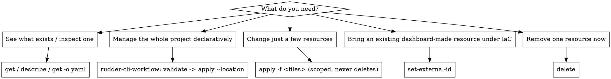

# Rudder CLI resource verbs (kubectl-style)

A live, per-resource verb layer over RudderStack resources — the imperative
counterpart to the declarative `validate → apply` cycle (see
`rudder-cli-workflow`). Use these to **look at**, **adopt**, or **remove one**
remote resource, and to apply **only specific files** without pruning the rest of
the workspace.

```
get <type> [<id>]                 list, show one, or export a re-appliable spec
describe <type> <id>              human-readable layout of one resource
set-external-id <type> <rid> <x>  adopt an unmanaged remote resource into IaC
delete <type> <id>                imperative remote delete of a managed resource
apply -f <file|dir>…              scoped, delete-free apply (never prunes)
```

## Experimental — enable once

This suite is gated behind an experimental flag. If a verb errors with
"…are experimental; enable them with…", run:

```bash
rudder-cli experimental enable resourceCommands
```

(or set `RUDDERSTACK_CLI_EXPERIMENTAL=true` and `RUDDERSTACK_X_RESOURCE_COMMANDS=true`
for a single invocation). Everything below assumes it is enabled and that
`rudder-cli` is authenticated (`rudder-cli workspace info`).

## When to reach for these vs the apply cycle



**Mental model:** `get`/`describe` are live reads (snappy, no local project needed).
`delete` and `set-external-id` are direct single-resource mutations. `apply -f`
reuses the normal apply planner but **scopes to the files you pass**, so it only
creates/updates and never deletes anything outside them — unlike
`apply --location`, which reconciles the whole project and can prune.

## Addressing a resource

`<type>` is the registry type string, e.g. `event-stream-source`,
`retl-source-sql-model`, `tracking-plan`, `account`. `<id>` resolves
**external-id first, then remote-id**. Unknown types error with the full valid
list; capability-unsupported verbs error clearly (e.g. `account` is read-only).

## get — discover and export

```bash
rudder-cli get event-stream-source                      # list (table)
rudder-cli get event-stream-source --managed            # only IaC-managed
rudder-cli get event-stream-source --unmanaged          # only upstream-only
rudder-cli get tracking-plan -l name="Checkout Plan"    # label selector
rudder-cli get event-stream-source my-source -o yaml    # re-appliable spec
rudder-cli get event-stream-source --managed -o json    # machine-readable list
```

The list columns are `EXTERNAL-ID · REMOTE-ID · NAME · MANAGED`. **`MANAGED=yes`
means the resource has an external id (IaC-tracked); `no` means it exists only in
the workspace** (e.g. created in the dashboard). `-o yaml` on a single resource
emits a spec that round-trips through `apply -f` — see
`references/round-trip-and-adoption.md`.

## describe — read one resource

```bash
rudder-cli describe event-stream-source my-source
```

A templated layout of the same spec `get -o yaml` produces, plus a `Managed`
line. Use it to explain a resource to a human; use `-o yaml`/`-o json` when you
need to parse or re-apply it.

## apply -f — scoped, delete-free changes

```bash
rudder-cli apply -f sources/orders.yaml --dry-run --confirm=false   # preview
rudder-cli apply -f sources/orders.yaml --confirm=false             # apply
rudder-cli apply -f sources/ -f tracking-plans/ --confirm=false     # multiple
```

- **`-f` never deletes** resources outside the given files — safe for targeted
  edits. `--location` (whole-project reconcile) can delete; the two are mutually
  exclusive.
- Always `--dry-run` first and read the plan. In agent/non-interactive contexts
  pass `--confirm=false` (the default prompt auto-declines when there's no TTY and
  nothing is applied, silently).
- Each `-f` path is validated independently; pass non-overlapping sets.

## set-external-id — adopt an unmanaged resource

```bash
# 1) find the unmanaged one (MANAGED=no, blank external id)
rudder-cli get event-stream-source --unmanaged
# 2) claim it by remote id, giving it the external id IaC will use
rudder-cli set-external-id event-stream-source <remote-id> orders-pipeline
```

After this the resource is `MANAGED=yes` and can be exported (`get -o yaml`),
`apply -f`-managed, or `delete`d. Only types whose provider supports it accept
`set-external-id`; others (e.g. `account`) refuse. See
`references/round-trip-and-adoption.md`.

## delete — remove one managed resource

```bash
rudder-cli delete event-stream-source my-source            # prompts to confirm
rudder-cli delete event-stream-source my-source --confirm  # skip the prompt
```

Deletes a **managed** resource (one with an external id) from the remote
workspace. Unmanaged resources are rejected — adopt them with `set-external-id`
first if you truly mean to remove them via IaC. `delete` is real and immediate;
prefer previewing with `get`/`describe` before removing.

## Safety checklist (agents)

- Confirm the target workspace first: `rudder-cli workspace info`.
- Read-only verbs (`get`, `describe`) are always safe. `delete`, `set-external-id`,
  and non-dry-run `apply -f` mutate the real workspace.
- Prefer `apply -f` over `apply --location` when the intent is "change these
  specific things" — it can't prune unrelated resources.
- In non-interactive runs, pass `--confirm=false` (apply) / `--confirm` (delete),
  or the operation silently no-ops on the auto-declined prompt.

## Coverage

`get` / `describe` / `-o yaml|json` work across registered types. Full mutate
support (`apply -f`, `delete`, `set-external-id`) is verified for
`event-stream-source` and `retl-source-sql-model`; other types offer whatever
their provider implements and refuse the rest with a clear error.
